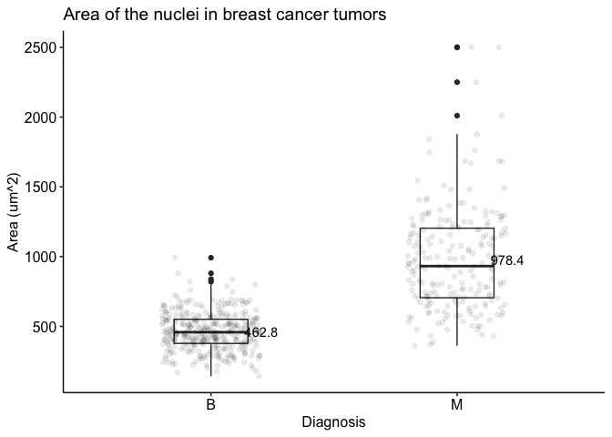
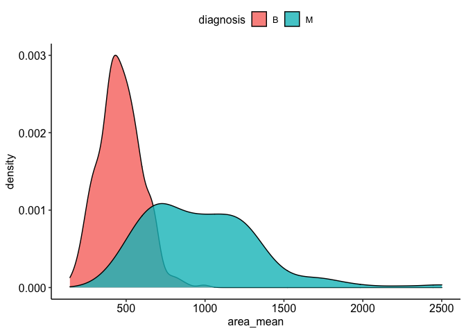
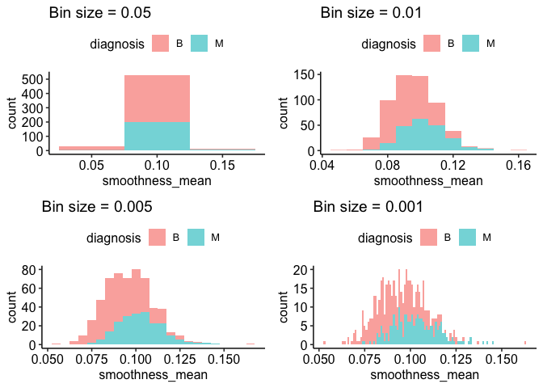
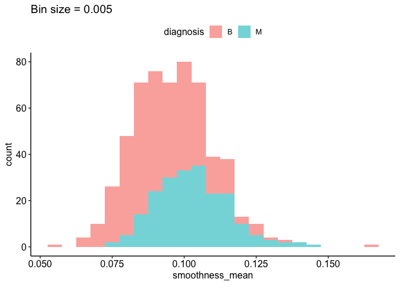
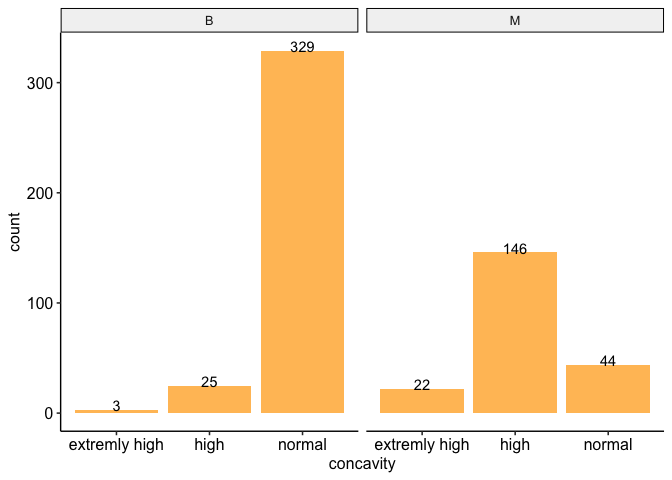
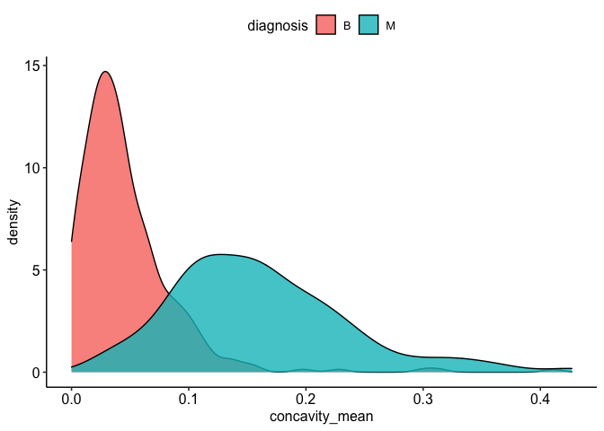
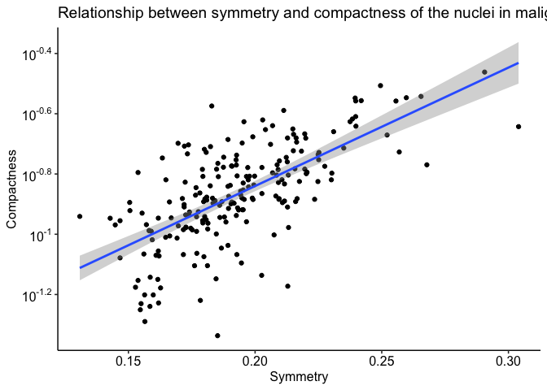
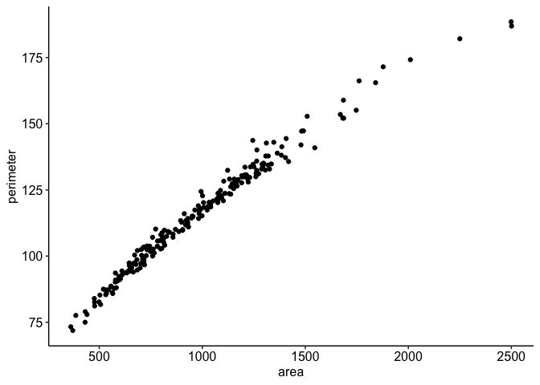

Milestone-2-Luque.Rmd
================
Ana Luque
October 19, 2021

Loading the packages:

``` r
#install packages with: install.packages("package") if not installed already
library(datateachr) #contains the cancer_sample data set I am working with.
library(tidyverse) #packages that allows to analyze data(tibble).
```

    ## ── Attaching packages ─────────────────────────────────────── tidyverse 1.3.1 ──

    ## ✓ ggplot2 3.3.5     ✓ purrr   0.3.4
    ## ✓ tibble  3.1.5     ✓ dplyr   1.0.7
    ## ✓ tidyr   1.1.4     ✓ stringr 1.4.0
    ## ✓ readr   2.0.2     ✓ forcats 0.5.1

    ## ── Conflicts ────────────────────────────────────────── tidyverse_conflicts() ──
    ## x dplyr::filter() masks stats::filter()
    ## x dplyr::lag()    masks stats::lag()

``` r
library(scales) #provides the internal scaling infrastructure used by ggplot2.
```

    ## 
    ## Attaching package: 'scales'

    ## The following object is masked from 'package:purrr':
    ## 
    ##     discard

    ## The following object is masked from 'package:readr':
    ## 
    ##     col_factor

``` r
library(broom) #provides the information of a model in a tibble.
library(ggpubr) #package that allows you to combine multiple plots in one graph.
theme_set(theme_pubr()) #Default function theme_pubr that creates a publication-ready theme.
```

# Task 1: Process and summarize your data

During Milestone 2, I will be working with the data set:
**Cancer_samples**. This tibble was obtained from the UCI Machine
Learning Repository and it contains information about the cell nuclei in
the biopsy of a breast cancer mass obtained with fine needle aspirate
(FNA) and analyzed through machine learning using digitized imaging. For
more information about the data set the README file can be consulted.

Data manipulation packages *(dyplr and tidyr)* will be used to explore
more in depth the data set.

## 1.1

By analyzing the content of the data set, four research questions were
generated, deeper analysis is needed to answer these questions. The main
idea of exploring *cancer_samples* is to determine if it is possible to
use Machine learning to process biopsy from cancer patience and
determine if the tumor is malign or benign. This could significantly
decrease the processing time it takes for the pathology department to
process samples. In cancer patients, time is quite valuable, the sooner
the treatment is started, the better the probabilities of surviving.

1.  Is there a difference within the area of the nuclei of benign and
    malign tumors?
2.  Do malign tumors have more variability in smoothness in their nuclei
    than benign tumors?
3.  Could it be possible to diagnose the tumor of a patient just by
    looking at the concavity of the nuclei?
4.  Is there a relationship between the symmetry of the nuclei and the
    compactness in malign tumors?

## 1.2

Analyzing the research questions with R studio using summarizing and
graphing packages

#### First research question

*Is there a difference within the area of the nuclei of benign and
malign tumors?*

The area of the nuclei in cancer biopsy is critical to determine if the
tissue is cancerous or not, therefore it is probable that a significant
difference between the area of malign and benign tumors can be seen and
used to diagnose the patients in a more efficient way.

In order to compare the areas, a *summarize table was made, including
the mean, standard deviation, median, minimum and maximum values of both
malign and benign tumors* so it would be easier to compare them.
Moreover, a box plot will be used to visually compare the mean and if
there is some data that intertwine between the two groups, a scatter
plot layer will be included in the graph to see the distribution of the
samples. Finally, the *two geom layer graphs will contain a text layer
with the mean obtained from the summarize table*

``` r
# The data set (tibble) that I will be using is cancer_samples, before using the functions of the tidyverse the tibble that will be analyzed must be stated.
#Group_by is used to create a grouped tibble so that the rest of the functions are perform in every group, in this case in both benign and malign tumors, and the results are shown separately.
#Arrange order the rows of a data frame in ascending order.
#Summarise allows you to create new columns of summarized variables, giving one row per group. It can be used to calculate summary statistics
#n() functions will count the number of rows in a group and will give the amount of benign and malign samples
#Mutate is used to create new variables using the existing variables, in this case is used in all numeric values to round up to one decimal
Q1.1 <- cancer_sample %>%
  group_by(diagnosis) %>%
  arrange(area_mean)  %>%
  summarise(Mean_area = mean(area_mean),
            SD_area = sd(area_mean),
            Min_area = min(area_mean),
            Median_area = median(area_mean),
            Max_area = max(area_mean), n=n()) %>%
  mutate(across(where(is.numeric), ~ round(., 1)))
Q1.1
```

    ## # A tibble: 2 × 7
    ##   diagnosis Mean_area SD_area Min_area Median_area Max_area     n
    ##   <chr>         <dbl>   <dbl>    <dbl>       <dbl>    <dbl> <dbl>
    ## 1 B              463.    134.     144.        458.     992.   357
    ## 2 M              978.    368.     362.        932     2501    212

``` r
# The aesthetic specification can be in the ggplot function or in the geom layers. To create a box plot both, x and y must be specified, in this case the distribution of the area of the benign and malign tumors will be plotted.
#To create a box plot the function geom_plot was used, setting a pre-difined width for the box.
#Geom_jitter was added in the same graph to visualize the distribution of the samples, 
#Geom_text was used to include the mean obtained in the summarize table of Q1.1, hjust is used to change the alignment horizontally.
#Labs is used to include the tittle and rename the x and y axis.
Q1.2 <- ggplot(cancer_sample, aes(diagnosis, area_mean)) + 
    geom_boxplot(width = 0.3) +
    geom_jitter(alpha = 0.08, width = 0.2) +
    geom_text(data = Q1.1, aes(y=Mean_area, label = round(Mean_area,2)), hjust=-1) +
    labs(title="Area of the nuclei in breast cancer tumors", y ="Area (um^2)", x = "Diagnosis")
print(Q1.2)
```

<!-- -->

``` r
#Another way of seeing if the values of the areas of both groups are overlapping is using a density plot with alpha transparency
#Alpha allows you to set a transparency value to the colors of the graph. The closer it is to 0 is the more transparent it will be. This allows to see if the density curves are overlapping, it can be outside the aesthetic specification because it is a pre-specified, constant value.
#The filling of the graph is inside the aesthetic specification of the geom_density because it corresponds to a variable in the data set.
Q1.3 <- ggplot(cancer_sample, aes(area_mean)) + 
    geom_density(aes(fill = diagnosis), alpha=0.8)  
print(Q1.3)
```

<!-- -->

**Analysis**

By looking at the grouped means, the difference between the two groups
is evident. The area of malign tumors is 211% larger than the one of
benign tumors. However, analyzing the box plot it can be seen that some
samples of the two groups overlap, meaning that the diagnosis of the
tumor cannot be only based on the area of their nuclei. The scatter plot
graph, show that benign tumors have more samples than malign tumors, as
the values from malign tumors are more dispersed. The minimum value of
the samples diagnosed as malign is 361, which is even lower than the
mean of benign tumors. Moreover, there are three outliers with high
values, the maximum value being 255% higher than the mean of malign
tumors. Furthermore, in the density plot is more evident that most
nuclei of benign tumors have lower values but a significant amount of
malign tumors overlap with the samples diagnosed as benign. It is
evident that in average, the nuclei area between the two groups is
different, but it can be used as the only approach to diagnose a cancer
patient.

#### Second research question

*Do malign tumors have more variability in smoothness in their nuclei
than benign tumors*

The smoothness of the nuclei of a tumor corresponds to the local
variation in radius lengths. The closer the smoothness is to one, the
more irregular shapes it has. According to the literature malign breast
tumors tend to have more variability in smoothness, and more variations
in their radius length since there is more diversity in their shapes,
they have lost their “normal” structure. Looking at the *summarize
variance of the two groups*, it could be possible to determine if the
malign tumor have more variability in their nuclei.A common method of
comparing variances is F-test, however, the values have to be normally
distributed for this test, so Shapiro test must be perform to know the
distribution. Moreover, using *histograms with different bin widths*,
the variability can be seen in a graphically when the sample has a
higher amount of taller bars across its range, far away from the mean.

``` r
# Grouping by diagnosis and using the summarise function is possible to determine the mean, standard deviation and variance of all the samples visualizing the general results for the malign and benign tumors. The var R function computes the sample variance of a numeric input, in this case the smoothness. The variance is a measure of dispersion that represents the variability of a series of data with respect to its medium. The standard deviation is the square root of the variance, so it also gives us an idea of the variability.
Q2.1 <- cancer_sample %>%
  group_by(diagnosis) %>%
  summarise(Mean_smoothness = mean(smoothness_mean),
            Mean_sesmoothness = mean(smoothness_se),
            SD_smoothness = sd(smoothness_mean), 
            Var_smoothness= var(smoothness_mean))
head(Q2.1)
```

    ## # A tibble: 2 × 5
    ##   diagnosis Mean_smoothness Mean_sesmoothness SD_smoothness Var_smoothness
    ##   <chr>               <dbl>             <dbl>         <dbl>          <dbl>
    ## 1 B                  0.0925           0.00720        0.0134       0.000181
    ## 2 M                  0.103            0.00678        0.0126       0.000159

``` r
#First, I separated the two diagnosis groups into two different tibbles using the filter function, so every row that has exactly ("==") B or M in the diagnosis column will become part of the corresponding data set. The pull function is used to select a column in the cancer_sample data frame and transforms it into a vector, so it can be used in the test.

BS <-cancer_sample %>%
  arrange(smoothness_mean)%>%
  filter(diagnosis == "B")%>%
  pull(smoothness_mean)
head(BS)
```

    ## [1] 0.05263 0.06251 0.06429 0.06576 0.06613 0.06828

``` r
MS <-cancer_sample %>%
  arrange(smoothness_mean)%>%
  filter(diagnosis == "M")%>%
  pull(smoothness_mean)
head(MS)
```

    ## [1] 0.07371 0.07497 0.07840 0.08020 0.08162 0.08206

``` r
#Using the shapiro test function we can know if the data is normally distributed using the shapiro.test function. The null hypothesis is that the data is normally distributed. 

shapiro.test(BS)
```

    ## 
    ##  Shapiro-Wilk normality test
    ## 
    ## data:  BS
    ## W = 0.97551, p-value = 9.507e-06

``` r
shapiro.test(MS)
```

    ## 
    ##  Shapiro-Wilk normality test
    ## 
    ## data:  MS
    ## W = 0.98469, p-value = 0.0215

``` r
# Four different histograms were made in order to know which bin width was better for the data set. Bin intervals need to have enough distance to include the upper and lower spec limits and the min and max values. With too many bins you can not see clearly the distribution.
#Bin width is used to change the width of the bins on the histogram, therefore, the number of bins.
#ggtitle is used to add a title to the graph, the name must be in quotation marks.

H1 <- ggplot(cancer_sample, aes(x=smoothness_mean)) + 
  geom_histogram(aes(fill=diagnosis), alpha = 0.6, binwidth=0.05) +
  ggtitle("Bin size = 0.05")

H2 <- ggplot(cancer_sample, aes(x=smoothness_mean)) + 
  geom_histogram(aes(fill=diagnosis), alpha = 0.6, binwidth=0.01) +
  ggtitle("Bin size = 0.01")

H3 <- ggplot(cancer_sample, aes(x=smoothness_mean)) + 
  geom_histogram(aes(fill=diagnosis), alpha = 0.6, binwidth=0.005) +
  ggtitle("Bin size = 0.005")

H4 <- ggplot(cancer_sample, aes(x=smoothness_mean)) + 
  geom_histogram(aes(fill=diagnosis), alpha = 0.6, binwidth=0.001) +
  ggtitle("Bin size = 0.001")

#ggarrange from the ggpubr package allows the combination of different graphs in one figure for better visualization, you can set the number and rows and columns in which the graphs will be placed.
Q2.2 <- ggarrange(H1, H2, H3, H4, 
          ncol = 2, nrow = 2)
print (Q2.2)
```

<!-- -->

``` r
#The best histogram is the one with a bin width of 0.005 because it is small enough to see the distribution of the values without hiding important details. Also is not too small so it doesn't generate a lot of noise, in which case a scatter plot would be best. 
Q2.3 <-H3
print(Q2.3)
```

<!-- -->

**Analysis**

On the contrary of what the initial hypothesis was, the samples of
benign tumors have more variability than the malign tumors. Benign
tumors have a higher standard deviation and variance. Also, the mean of
the standard error of every sample was higher meaning that they have
more variability in smoothness between samples.

The p-value of the Shapiro test is less than 0.05, implying that the
distribution of the data is significantly different from normal
distribution. Since the data is not normally distributed F test can’t be
used to compare variances between the smoothness in benign and malign
tumors. The F-test in R can be performed using (var.test(x, y,
alternative = ““)).

Moreover, in the histogram it can be seen in a more graphic way that
there is more variability in the benign tumors than in the malign ones,
as there are more tall bars near the mean. Also, the bars are taller in
the benign tumors, but that is because the number of samples of benign
tumors is bigger.

#### Third research question

*Could it be possible to diagnose the tumor of a patient just by looking
at the concavity of the nuclei?*

The concavity of the nuclei refers to the severity of concave portions
of the contour, so it is related to smoothness. The higher the concavity
the less likely that cells look spherical. healthy cells have spherical
or oblong nucleus without severe concave portions. My hypothesis is that
benign tumors will have lower concavity than malign tumors and that can
be used as a factor to diagnose the patient using biopsies. To examine
the data a summarize table was made to know the main static values of
both groups and see if there is an evident difference between them.

*Moreover three categorical values were created from the existing data
of concavity*. Normal corresponds to nuclei whose concavity value is
less than 0.1, which is closer to the shape of healthy cells. If the
concavity is between 0.1 and 0.25, is labeled as high, since those
values indicate that there is a clear problem with the cell. Higher than
0.25 were classified as very high, those cells have an aberrant nucleus
and definitely are undergoing a tumorous process.

The number of samples of each category separated by diagnosis group will
be shown in a table and in a *histogram with two geom layers and the
exact number of samples in every group* to see if there is clear
evidence that benign tumors have lower concavity values than malign
ones.

``` r
#To know the basic information about concavity a summarize table was created, similar to the one done for the first research question but without grouping by diagnosis, just to know the range of values to generate the categories.
Q3.1 <- cancer_sample %>%
  arrange(concavity_mean)  %>%
  summarise(Mean_concavity = mean(concavity_mean),
            Min_concavity = min(concavity_mean),
            Median_concavity = median(concavity_mean),
            Max_concavity = max(concavity_mean)) %>%
              mutate(across(where(is.numeric), ~ round(., 3)))
Q3.1
```

    ## # A tibble: 1 × 4
    ##   Mean_concavity Min_concavity Median_concavity Max_concavity
    ##            <dbl>         <dbl>            <dbl>         <dbl>
    ## 1          0.089             0            0.062         0.427

``` r
# A tibble was created with just the variables of interest, diagnosis and concavity using the function select.
#Using the arrange function the tibble was reordered by the ascending values of concavity
#The numerical variable of concavity were divided into low, high, and very high categories using the mutate function to create a new column. 
#Case_when was used to categorize the values into 3 different categories, the true value is stated for the values that didn't meet the categories established before.
Q3.2 <- cancer_sample %>%
    select(diagnosis, concavity_mean) %>%
    arrange(concavity_mean) %>%
     mutate(concavity = case_when (concavity_mean <0.1 ~  "normal", 
                                   concavity_mean <0.25 ~  "high", 
                                   TRUE ~ "extremly high"))
Q3.2
```

    ## # A tibble: 569 × 3
    ##    diagnosis concavity_mean concavity
    ##    <chr>              <dbl> <chr>    
    ##  1 B                      0 normal   
    ##  2 B                      0 normal   
    ##  3 B                      0 normal   
    ##  4 B                      0 normal   
    ##  5 B                      0 normal   
    ##  6 B                      0 normal   
    ##  7 B                      0 normal   
    ##  8 B                      0 normal   
    ##  9 B                      0 normal   
    ## 10 B                      0 normal   
    ## # … with 559 more rows

``` r
#The count function is used create a summary of the frequencies of two categorical values, a tibble is created summarizing how many samples are in every category by group of diagnosis. 
Q3.3 <- count(Q3.2, diagnosis, concavity) 
head(Q3.3)
```

    ## # A tibble: 6 × 3
    ##   diagnosis concavity         n
    ##   <chr>     <chr>         <int>
    ## 1 B         extremly high     3
    ## 2 B         high             25
    ## 3 B         normal          329
    ## 4 M         extremly high    22
    ## 5 M         high            146
    ## 6 M         normal           44

``` r
# A bar graph was created using the ggplot2 package to visualize the number of samples in every category, the function ..count.. is used instead of the y axis to the bar graph, being able to show the number of samples instead of the frequencies.  
# Using geom_text the exact number of every category will appear in a label at the top of the bar graph. 
Q3.4 <- ggplot(Q3.2, aes(concavity, ..count..)) +
   geom_bar(fill= "orange", alpha = 0.7, position = "dodge") +
   facet_wrap(~ diagnosis) +
   geom_text(aes(label = ..count..), stat = "count", vjust = 0.1)
print(Q3.4)
```

<!-- -->

``` r
#A density plot was created to see if there is a clear difference between benign and malign tumors.
#Alpha transparency is used to visualize the intersections of the two groups. 
Ex3.5 <- ggplot(cancer_sample, aes(concavity_mean)) + 
    geom_density(aes(fill = diagnosis), alpha=0.8)
print(Ex3.5)
```

<!-- -->

**Analysis**

The concavity values go from 0.00 to 0.427, therefore three categories
were made to evaluate the severity of the concave points. Looking at the
tibble Q3.3 it is evident that both groups have representation in the
three categories so the hypothesis was not true. Indeed, benign tumors
have a major percentage of “normal” concavity, but there are some
samples that are both in the high and very high categories. Therefore,
the patients can’t be diagnosed just by looking at the concavity of the
nuclei. Looking at the bar graph in Q3.4 is clear that most samples are
in the high and extremely high categories, meaning that it is most
probable that malign tumors have nuclei with big concavity sections.

Finally, analyzing the density plot, there is visual evidence that both
groups overlap and it is impossible to separate them using the concavity
values. The malign tumors have more variability than the benign ones.
There are some samples that have values as low as zero and it wouldn’t
be correct to diagnose using just this variable.

#### Fourth research question

*Is there a relationship between the symmetry of the nuclei and the
compactness in malign tumors?*

The nuclei compactness refers to the ratio between the perimeter and the
area perimeter^2 / area - 1.0, so it is easier to obtain than symmetry.
If there is a clear relationship between the symmetry and the
compactness a model one variable could be used to predict the value of
the other one. Both values are important because malign tumors tend to
have less symmetry in their nuclei and bigger area and perimeter.

A tibble was created to see the symmetry and compactness of malign
tumors. Moreover the size of the sample was computed by *counting the
number of observations of malign tumors* to see if it is a
representative sample of the population. A graph was created to see the
relationships of both variables using a scatter plot, *the scale of the
y axis was changed to logarithmic* so the points in the scatter plot are
not so overlapped, and it is easier to see a relationship. Later on
model fitting was used to actually see if there is a linear relationship
between the two variables.

``` r
#A tibble was create extracting just the information of malign tumors using the filter functions that returns juts the rows that contain M in the diagnosis column. 
Q4.1 <- cancer_sample %>%
  rename(c("symmetry"="symmetry_mean", "compactness"="compactness_mean")) %>%
  select(diagnosis, symmetry, compactness) %>%
  arrange(symmetry)%>%
  filter(diagnosis == "M")
head(Q4.1)
```

    ## # A tibble: 6 × 3
    ##   diagnosis symmetry compactness
    ##   <chr>        <dbl>       <dbl>
    ## 1 M            0.131      0.115 
    ## 2 M            0.143      0.113 
    ## 3 M            0.145      0.107 
    ## 4 M            0.147      0.0835
    ## 5 M            0.147      0.111 
    ## 6 M            0.150      0.128

``` r
#The count function gives back the number of observations in a categorical variable, since it is using the tibble created in Q4.1 it will yield the number of samples diagnosed as malign
Q4.2 <- count(Q4.1, diagnosis)
head(Q4.2)
```

    ## # A tibble: 1 × 2
    ##   diagnosis     n
    ##   <chr>     <int>
    ## 1 M           212

``` r
# A scatter plot was created using geom_point.
# Geom_smooth aids the the visualization of patterns in the presence of over plotting.lLm is used to see if there is a linear relationship.
# The scale of the y axis was changed to logarithmic using the scale_y_continuous function of scales package and is labeled using labels.
#Code was created based in the one from: http://www.sthda.com/english/wiki/ggplot2-axis-scales-and-transformations#axis-transformations
Q4.3 <- ggplot(Q4.1, aes(symmetry, compactness)) + 
  geom_point() +
  geom_smooth(method = lm, formula = y ~ x) +
  scale_y_continuous(trans = log10_trans(),
    breaks = trans_breaks("log10", function(x) 10^x),
    labels = trans_format("log10", math_format(10^.x))) +
    labs(title="Relationship between symmetry and compactness of the nuclei in malignt breast tumors", y ="Compactness", x = "Symmetry")
print(Q4.3)
```

<!-- -->

``` r
#The lm function was used to obtain a linear model that shows the relationship between the two variables.
# Glance function was used from the broom package to see a summary of the model fit.
Q4.4 <- glance((lm(symmetry ~ compactness, Q4.1)))
print(Q4.4)
```

    ## # A tibble: 1 × 12
    ##   r.squared adj.r.squared  sigma statistic  p.value    df logLik    AIC    BIC
    ##       <dbl>         <dbl>  <dbl>     <dbl>    <dbl> <dbl>  <dbl>  <dbl>  <dbl>
    ## 1     0.487         0.485 0.0198      200. 2.70e-32     1   531. -1057. -1046.
    ## # … with 3 more variables: deviance <dbl>, df.residual <int>, nobs <int>

**Analysis**

The number of malign samples is adequate for the study it has certain
representativeness, a bigger sample size would be better considering the
amount of people with breast cancer, but is good for a first approach.
In the scatter plot it can be seen that in general there is a tendency
in which, with higher symmetry there is higher compactness. However,
some samples that do not follow that prediction. The smooth line
presented in the graph shows that there is not a clear linear
relationship. By analyzing the results from the glance function is
evident that the values don’t have a linear relationship since the
r.squared value is very low, meaning that the independent variable has
not a linear tendency compared with the dependent variable. Therefore
the model cannot be used to see predictions of one of the variables.

## 1.3

As seen in task 1.2 all questions were answered with the analysis done.
However, there is a need for more information to validate those
statements. For example, a critical factor in cancer patients is the
stage of the tumor; at a higher stage the cells are more different than
normal cells. Knowing the stage of the tumors could be helpful to
separate the samples and have more robust analyzis. More malign tumors
would be needed To have more reliable results, since the population of
benign tumors is significantly bigger in this data set. Also, an
interesting factor to analyze is the mutation related to benign and
malign tumors on those samples, extracting DNA from the biopsy. However,
for that study more experiments would be needed. Moreover, all the data
was obtained thought machine learning, however it would be good that a
pathologist could validate the information to confirm that the findings
are correct and that there is no over or underestimation of the program.
With this step, the results obtained from the analysis can be validated.

Research question 1 yielded exciting results as it was seen that the is
a clear difference between the average mean in the area of the nuclei.
However, there is wide variability in the samples, so more information
would be needed to validate the diagnosis. Question 2 could be
re-defined since not much information can be obtained from the
variability of the sample, just to know that it cannot be quite useful
for determining if the tumor is benign or malign. Another variable could
be explored, like the perimeter. Research question 3 yielded different
results from what I was expecting, since benign tumors also have very
high concavity. The research question will need to be re-defined to
include other variables. So it would be possible to diagnose a tumor
with just some values obtained from a biopsy. The fourth research
question could be re-defined; maybe different variables can be compared
to create a model since the ones analyzed didn’t have a linear
relationship. Nevertheless, it is unclear if other models could fit to
represent the relations between these two variables

# Task 2: Tidy your data

## 2.1

By selecting just 8 columns from cancer_samples and creating a tibble is
evident that *the data is tidy*.

-   Every header of a column is a variable that shows different aspects
    of the nuclei.
-   There are not multiple variables in one column of the samples.
-   Every row is an observation of a categorical variable, ether malign
    or benign.
-   Every cell as a numerical value.

In this arrangement is easy to analyze the data extracting certain
variables and filtering specific observations, so it is possible to use
the functions in the tidyverse package.

``` r
#The first example of a tidy tibble was made by just selecting 8 columns from the original data set.
T2.1<- cancer_sample %>%
  select(diagnosis, area_mean, perimeter_mean, smoothness_mean, concavity_mean, symmetry_mean, compactness_mean, texture_mean)
T2.1
```

    ## # A tibble: 569 × 8
    ##    diagnosis area_mean perimeter_mean smoothness_mean concavity_mean
    ##    <chr>         <dbl>          <dbl>           <dbl>          <dbl>
    ##  1 M             1001           123.           0.118          0.300 
    ##  2 M             1326           133.           0.0847         0.0869
    ##  3 M             1203           130            0.110          0.197 
    ##  4 M              386.           77.6          0.142          0.241 
    ##  5 M             1297           135.           0.100          0.198 
    ##  6 M              477.           82.6          0.128          0.158 
    ##  7 M             1040           120.           0.0946         0.113 
    ##  8 M              578.           90.2          0.119          0.0937
    ##  9 M              520.           87.5          0.127          0.186 
    ## 10 M              476.           84.0          0.119          0.227 
    ## # … with 559 more rows, and 3 more variables: symmetry_mean <dbl>,
    ## #   compactness_mean <dbl>, texture_mean <dbl>

``` r
#Another example of a tidy tibble is the one below. Instead of having all the different observations individually they were summarized by group obtaining the mean along the two diagnoses for each numerical value. 
T2.2<- cancer_sample %>%
  group_by(diagnosis) %>%
  summarise(Mean_area= mean(area_mean), 
            Mean_perimeter= mean(perimeter_mean), 
            Mean_smoothness = mean(smoothness_mean),
            Mean_concavity= mean(concavity_mean),
            Mean_symmetry= mean(symmetry_mean), 
            Mean_compactness= mean(compactness_mean), 
            Mean_texture= mean(texture_mean))
T2.2
```

    ## # A tibble: 2 × 8
    ##   diagnosis Mean_area Mean_perimeter Mean_smoothness Mean_concavity
    ##   <chr>         <dbl>          <dbl>           <dbl>          <dbl>
    ## 1 B              463.           78.1          0.0925         0.0461
    ## 2 M              978.          115.           0.103          0.161 
    ## # … with 3 more variables: Mean_symmetry <dbl>, Mean_compactness <dbl>,
    ## #   Mean_texture <dbl>

## 2.2

Since my data was tidy, I untidy it to show how it would be messy to
have it in an untidy form, if I try to untidy the T2.1 tidy tibble it
would result in an error since values are not uniquely identified. For
that reason the data will be untidy.

Furthermore, if I untidy the T2.2 tibble that contains the summarized
values a tibble without error is created. It is easier to understand and
to compare the two groups in the diagnostic variable. However, it would
be hard to work with it, needing to make some transformation to use
ggplot2 and the tidyverse package, since there are variables stored in a
variable (Measurement.

Finally, I tidy the untidy data to transform it back to its original
form in which analysis can be done to answer the corresponding research
questions.

``` r
#The first tidy tibble was transformed using pivot_longer and pivot_wider from the tidyverse package.
#Pivot_longer increases the number of rows and decreases either number of column, so it will transpose the columns to rows, except diagnosis since it has a "-" in front of it, you need to establish the header of the new column with "name_to".
#Pivot_wider increases the number of columns and decreases the number of rows, so the names found in the column diagnosis will be placed as column headers and the values as cells.
 T2.3<- T2.1 %>%
               pivot_longer(cols = -diagnosis, names_to = 'Measrument')  %>% 
               pivot_wider(names_from = diagnosis, values_from = value)
```

    ## Warning: Values are not uniquely identified; output will contain list-cols.
    ## * Use `values_fn = list` to suppress this warning.
    ## * Use `values_fn = length` to identify where the duplicates arise
    ## * Use `values_fn = {summary_fun}` to summarise duplicates

``` r
T2.3
```

    ## # A tibble: 7 × 3
    ##   Measrument       M           B          
    ##   <chr>            <list>      <list>     
    ## 1 area_mean        <dbl [212]> <dbl [357]>
    ## 2 perimeter_mean   <dbl [212]> <dbl [357]>
    ## 3 smoothness_mean  <dbl [212]> <dbl [357]>
    ## 4 concavity_mean   <dbl [212]> <dbl [357]>
    ## 5 symmetry_mean    <dbl [212]> <dbl [357]>
    ## 6 compactness_mean <dbl [212]> <dbl [357]>
    ## 7 texture_mean     <dbl [212]> <dbl [357]>

``` r
#Since the transformation above yielded an error I use the same code to transform the summarized tibble to show the result of untidy data.
T2.4<- T2.2 %>%
               pivot_longer(cols = -diagnosis, names_to = "Measurement") %>% 
               pivot_wider(names_from = diagnosis, values_from = value)
T2.4
```

    ## # A tibble: 7 × 3
    ##   Measurement             B       M
    ##   <chr>               <dbl>   <dbl>
    ## 1 Mean_area        463.     978.   
    ## 2 Mean_perimeter    78.1    115.   
    ## 3 Mean_smoothness    0.0925   0.103
    ## 4 Mean_concavity     0.0461   0.161
    ## 5 Mean_symmetry      0.174    0.193
    ## 6 Mean_compactness   0.0801   0.145
    ## 7 Mean_texture      17.9     21.6

``` r
#To tidy the untidy data, first all the columns headers (M and B) except measurements will become rows (observations) and all the names in the measurement column will become column headers. Finally the values are obtained from the numerical variables in the tibble.
T2.5 <- T2.4 %>%
  pivot_longer(cols = c(-Measurement), names_to = "Diagnosis") %>% 
      pivot_wider(names_from = Measurement, values_from = value)
T2.5
```

    ## # A tibble: 2 × 8
    ##   Diagnosis Mean_area Mean_perimeter Mean_smoothness Mean_concavity
    ##   <chr>         <dbl>          <dbl>           <dbl>          <dbl>
    ## 1 B              463.           78.1          0.0925         0.0461
    ## 2 M              978.          115.           0.103          0.161 
    ## # … with 3 more variables: Mean_symmetry <dbl>, Mean_compactness <dbl>,
    ## #   Mean_texture <dbl>

## 2.3

Based on my interest and the results that were obtained after the
analysis, I chose to continue with the following research questions

*1. Could it be possible to diagnose the tumor of a patient just by
looking at the concavity of the nuclei?*

*2. Is there a relationship between the area of the nuclei and the
perimeter in malign tumors?*

Since the data set does not contain many categorical variables, the
categories I made from concavity could be useful to develop the
exercises in Milestone 3. Moreover, I analyzed the other variables and
all of them overlap between the two groups but the one with a clearer
distinction is the concavity. Also, it is a crucial element for a
pathologist to observe while analyzing biopsies.

Furthermore, I changed one of my research questions so it would be
possible to create a model that accurately creates predictions based on
two variables. Both perimeter and area should be related by a linear
model. However since the data was obtained by computational analysis
maybe the model won’t be perfect and I think is worth exploring it.
Finally these two variables are the ones whose mean values grouped by
diagnosis are more different between them. So analyzing them could give
us a good approach to determine the diagnose of a biopsy.

``` r
#The variables of interest were renamed so it will be easier to call them in a function.
#The variables of interest were selected, dropping irrelevant columns.
#It was arranged in ascending order according to the concavity.
#It was grouped by diagnosis.
#The mean of two groups was obtained.
#Mutate was used to round to 3 decimals.
T2.6 <- cancer_sample %>%
  rename(c("concavity"="concavity_mean"))%>%
  select(diagnosis, concavity) %>%
  arrange(concavity)  %>%
  group_by(diagnosis)%>%
  summarise(Mean_concavity = mean(concavity)) %>%
  mutate(across(where(is.numeric), ~ round(., 3)))
T2.6
```

    ## # A tibble: 2 × 2
    ##   diagnosis Mean_concavity
    ##   <chr>              <dbl>
    ## 1 B                  0.046
    ## 2 M                  0.161

``` r
#The variables of interest were renamed so it will be easier to call them in a function.
#The variables of interest were selected, dropping irrelevant columns.
#It was arranged in ascending order according to the area.
#It was filtered just the samples diagnosed as malign.
#A scatter plot was created to see the relationship between the two variables. 
T2.7<- cancer_sample %>%
  rename(c("area"="area_mean", "perimeter"="perimeter_mean")) %>%
  select(diagnosis, area, perimeter) %>%
  arrange(area)%>%
  filter(diagnosis == "M")%>%
  ggplot(aes(area, perimeter)) + 
  geom_point()
T2.7
```

<!-- -->
