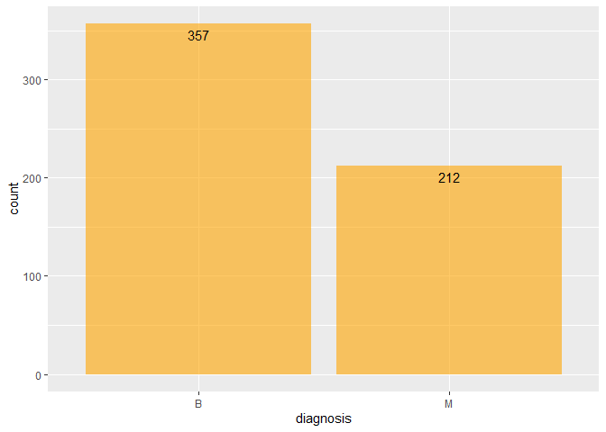
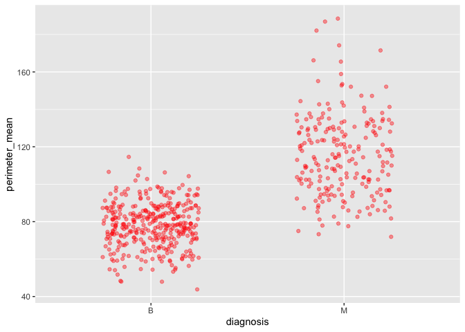
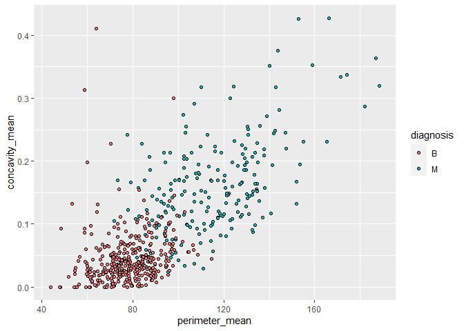
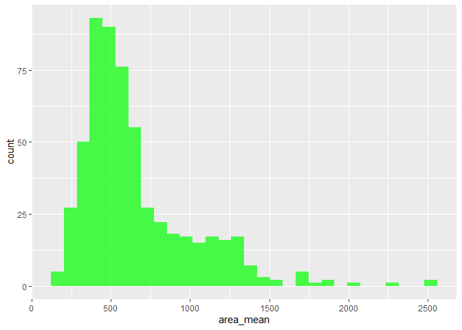
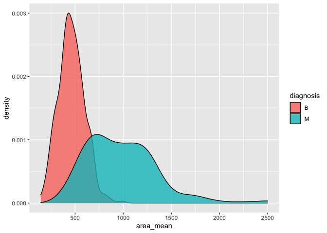

Milestone-1-Luque.Rmd
================
Ana Luque
October 09, 2021

Loading the packages:

``` r
#install packages with: install.packages() if not installed already
library(datateachr)
library(tidyverse)
```

    ## -- Attaching packages --------------------------------------- tidyverse 1.3.1 --

    ## v ggplot2 3.3.5     v purrr   0.3.4
    ## v tibble  3.1.4     v dplyr   1.0.7
    ## v tidyr   1.1.3     v stringr 1.4.0
    ## v readr   2.0.1     v forcats 0.5.1

    ## -- Conflicts ------------------------------------------ tidyverse_conflicts() --
    ## x dplyr::filter() masks stats::filter()
    ## x dplyr::lag()    masks stats::lag()

# Task 1: Choose your favorite dataset

## 1.1

Based on the description of the data sets the ones that looked more
interesting and worth of data analysis were:

*1. Flow sample* *2. Cancer sample* *3. Vancouver trees* *4. Steam
games*

## 1.2

Exploring more information about the tibbles.

``` r
#Exploring the Flow_sample tibble
#To know the name of the columns, number of rows and columns glimpse function can be used
glimpse(flow_sample)
```

    ## Rows: 218
    ## Columns: 7
    ## $ station_id   <chr> "05BB001", "05BB001", "05BB001", "05BB001", "05BB001", "0~
    ## $ year         <dbl> 1909, 1910, 1911, 1912, 1913, 1914, 1915, 1916, 1917, 191~
    ## $ extreme_type <chr> "maximum", "maximum", "maximum", "maximum", "maximum", "m~
    ## $ month        <dbl> 7, 6, 6, 8, 6, 6, 6, 6, 6, 6, 6, 7, 6, 6, 6, 7, 5, 7, 6, ~
    ## $ day          <dbl> 7, 12, 14, 25, 11, 18, 27, 20, 17, 15, 22, 3, 9, 5, 14, 5~
    ## $ flow         <dbl> 314, 230, 264, 174, 232, 214, 236, 309, 174, 345, 185, 24~
    ## $ sym          <chr> NA, NA, NA, NA, NA, NA, NA, NA, NA, NA, NA, NA, NA, NA, N~

``` r
#Function used to open the data in the RStudio Data Window
tibble::view(flow_sample)
# Class prints the vector of names of classes an object inherits from.
class(flow_sample)
```

    ## [1] "tbl_df"     "tbl"        "data.frame"

``` r
#Returns the first 6 rows of a data frame,
head(flow_sample)
```

    ## # A tibble: 6 x 7
    ##   station_id  year extreme_type month   day  flow sym  
    ##   <chr>      <dbl> <chr>        <dbl> <dbl> <dbl> <chr>
    ## 1 05BB001     1909 maximum          7     7   314 <NA> 
    ## 2 05BB001     1910 maximum          6    12   230 <NA> 
    ## 3 05BB001     1911 maximum          6    14   264 <NA> 
    ## 4 05BB001     1912 maximum          8    25   174 <NA> 
    ## 5 05BB001     1913 maximum          6    11   232 <NA> 
    ## 6 05BB001     1914 maximum          6    18   214 <NA>

``` r
#Summary returns an overview over the different feature columns, their type and basic distribution information.
summary(flow_sample)
```

    ##   station_id             year      extreme_type           month       
    ##  Length:218         Min.   :1909   Length:218         Min.   : 1.000  
    ##  Class :character   1st Qu.:1936   Class :character   1st Qu.: 3.000  
    ##  Mode  :character   Median :1963   Mode  :character   Median : 6.000  
    ##                     Mean   :1963                      Mean   : 5.046  
    ##                     3rd Qu.:1990                      3rd Qu.: 6.000  
    ##                     Max.   :2018                      Max.   :12.000  
    ##                                                       NA's   :2       
    ##       day             flow            sym           
    ##  Min.   : 1.00   Min.   :  3.62   Length:218        
    ##  1st Qu.: 8.00   1st Qu.:  6.18   Class :character  
    ##  Median :17.00   Median :114.00   Mode  :character  
    ##  Mean   :16.24   Mean   :110.13                     
    ##  3rd Qu.:25.00   3rd Qu.:204.25                     
    ##  Max.   :31.00   Max.   :466.00                     
    ##  NA's   :2       NA's   :2

``` r
#Exploring the cancer_sample
glimpse(cancer_sample)
```

    ## Rows: 569
    ## Columns: 32
    ## $ ID                      <dbl> 842302, 842517, 84300903, 84348301, 84358402, ~
    ## $ diagnosis               <chr> "M", "M", "M", "M", "M", "M", "M", "M", "M", "~
    ## $ radius_mean             <dbl> 17.990, 20.570, 19.690, 11.420, 20.290, 12.450~
    ## $ texture_mean            <dbl> 10.38, 17.77, 21.25, 20.38, 14.34, 15.70, 19.9~
    ## $ perimeter_mean          <dbl> 122.80, 132.90, 130.00, 77.58, 135.10, 82.57, ~
    ## $ area_mean               <dbl> 1001.0, 1326.0, 1203.0, 386.1, 1297.0, 477.1, ~
    ## $ smoothness_mean         <dbl> 0.11840, 0.08474, 0.10960, 0.14250, 0.10030, 0~
    ## $ compactness_mean        <dbl> 0.27760, 0.07864, 0.15990, 0.28390, 0.13280, 0~
    ## $ concavity_mean          <dbl> 0.30010, 0.08690, 0.19740, 0.24140, 0.19800, 0~
    ## $ concave_points_mean     <dbl> 0.14710, 0.07017, 0.12790, 0.10520, 0.10430, 0~
    ## $ symmetry_mean           <dbl> 0.2419, 0.1812, 0.2069, 0.2597, 0.1809, 0.2087~
    ## $ fractal_dimension_mean  <dbl> 0.07871, 0.05667, 0.05999, 0.09744, 0.05883, 0~
    ## $ radius_se               <dbl> 1.0950, 0.5435, 0.7456, 0.4956, 0.7572, 0.3345~
    ## $ texture_se              <dbl> 0.9053, 0.7339, 0.7869, 1.1560, 0.7813, 0.8902~
    ## $ perimeter_se            <dbl> 8.589, 3.398, 4.585, 3.445, 5.438, 2.217, 3.18~
    ## $ area_se                 <dbl> 153.40, 74.08, 94.03, 27.23, 94.44, 27.19, 53.~
    ## $ smoothness_se           <dbl> 0.006399, 0.005225, 0.006150, 0.009110, 0.0114~
    ## $ compactness_se          <dbl> 0.049040, 0.013080, 0.040060, 0.074580, 0.0246~
    ## $ concavity_se            <dbl> 0.05373, 0.01860, 0.03832, 0.05661, 0.05688, 0~
    ## $ concave_points_se       <dbl> 0.015870, 0.013400, 0.020580, 0.018670, 0.0188~
    ## $ symmetry_se             <dbl> 0.03003, 0.01389, 0.02250, 0.05963, 0.01756, 0~
    ## $ fractal_dimension_se    <dbl> 0.006193, 0.003532, 0.004571, 0.009208, 0.0051~
    ## $ radius_worst            <dbl> 25.38, 24.99, 23.57, 14.91, 22.54, 15.47, 22.8~
    ## $ texture_worst           <dbl> 17.33, 23.41, 25.53, 26.50, 16.67, 23.75, 27.6~
    ## $ perimeter_worst         <dbl> 184.60, 158.80, 152.50, 98.87, 152.20, 103.40,~
    ## $ area_worst              <dbl> 2019.0, 1956.0, 1709.0, 567.7, 1575.0, 741.6, ~
    ## $ smoothness_worst        <dbl> 0.1622, 0.1238, 0.1444, 0.2098, 0.1374, 0.1791~
    ## $ compactness_worst       <dbl> 0.6656, 0.1866, 0.4245, 0.8663, 0.2050, 0.5249~
    ## $ concavity_worst         <dbl> 0.71190, 0.24160, 0.45040, 0.68690, 0.40000, 0~
    ## $ concave_points_worst    <dbl> 0.26540, 0.18600, 0.24300, 0.25750, 0.16250, 0~
    ## $ symmetry_worst          <dbl> 0.4601, 0.2750, 0.3613, 0.6638, 0.2364, 0.3985~
    ## $ fractal_dimension_worst <dbl> 0.11890, 0.08902, 0.08758, 0.17300, 0.07678, 0~

``` r
tibble::view(cancer_sample)
class(cancer_sample)
```

    ## [1] "spec_tbl_df" "tbl_df"      "tbl"         "data.frame"

``` r
head(cancer_sample)
```

    ## # A tibble: 6 x 32
    ##         ID diagnosis radius_mean texture_mean perimeter_mean area_mean
    ##      <dbl> <chr>           <dbl>        <dbl>          <dbl>     <dbl>
    ## 1   842302 M                18.0         10.4          123.      1001 
    ## 2   842517 M                20.6         17.8          133.      1326 
    ## 3 84300903 M                19.7         21.2          130       1203 
    ## 4 84348301 M                11.4         20.4           77.6      386.
    ## 5 84358402 M                20.3         14.3          135.      1297 
    ## 6   843786 M                12.4         15.7           82.6      477.
    ## # ... with 26 more variables: smoothness_mean <dbl>, compactness_mean <dbl>,
    ## #   concavity_mean <dbl>, concave_points_mean <dbl>, symmetry_mean <dbl>,
    ## #   fractal_dimension_mean <dbl>, radius_se <dbl>, texture_se <dbl>,
    ## #   perimeter_se <dbl>, area_se <dbl>, smoothness_se <dbl>,
    ## #   compactness_se <dbl>, concavity_se <dbl>, concave_points_se <dbl>,
    ## #   symmetry_se <dbl>, fractal_dimension_se <dbl>, radius_worst <dbl>,
    ## #   texture_worst <dbl>, perimeter_worst <dbl>, area_worst <dbl>, ...

``` r
summary(cancer_sample)
```

    ##        ID             diagnosis          radius_mean      texture_mean  
    ##  Min.   :     8670   Length:569         Min.   : 6.981   Min.   : 9.71  
    ##  1st Qu.:   869218   Class :character   1st Qu.:11.700   1st Qu.:16.17  
    ##  Median :   906024   Mode  :character   Median :13.370   Median :18.84  
    ##  Mean   : 30371831                      Mean   :14.127   Mean   :19.29  
    ##  3rd Qu.:  8813129                      3rd Qu.:15.780   3rd Qu.:21.80  
    ##  Max.   :911320502                      Max.   :28.110   Max.   :39.28  
    ##  perimeter_mean     area_mean      smoothness_mean   compactness_mean 
    ##  Min.   : 43.79   Min.   : 143.5   Min.   :0.05263   Min.   :0.01938  
    ##  1st Qu.: 75.17   1st Qu.: 420.3   1st Qu.:0.08637   1st Qu.:0.06492  
    ##  Median : 86.24   Median : 551.1   Median :0.09587   Median :0.09263  
    ##  Mean   : 91.97   Mean   : 654.9   Mean   :0.09636   Mean   :0.10434  
    ##  3rd Qu.:104.10   3rd Qu.: 782.7   3rd Qu.:0.10530   3rd Qu.:0.13040  
    ##  Max.   :188.50   Max.   :2501.0   Max.   :0.16340   Max.   :0.34540  
    ##  concavity_mean    concave_points_mean symmetry_mean    fractal_dimension_mean
    ##  Min.   :0.00000   Min.   :0.00000     Min.   :0.1060   Min.   :0.04996       
    ##  1st Qu.:0.02956   1st Qu.:0.02031     1st Qu.:0.1619   1st Qu.:0.05770       
    ##  Median :0.06154   Median :0.03350     Median :0.1792   Median :0.06154       
    ##  Mean   :0.08880   Mean   :0.04892     Mean   :0.1812   Mean   :0.06280       
    ##  3rd Qu.:0.13070   3rd Qu.:0.07400     3rd Qu.:0.1957   3rd Qu.:0.06612       
    ##  Max.   :0.42680   Max.   :0.20120     Max.   :0.3040   Max.   :0.09744       
    ##    radius_se        texture_se      perimeter_se       area_se       
    ##  Min.   :0.1115   Min.   :0.3602   Min.   : 0.757   Min.   :  6.802  
    ##  1st Qu.:0.2324   1st Qu.:0.8339   1st Qu.: 1.606   1st Qu.: 17.850  
    ##  Median :0.3242   Median :1.1080   Median : 2.287   Median : 24.530  
    ##  Mean   :0.4052   Mean   :1.2169   Mean   : 2.866   Mean   : 40.337  
    ##  3rd Qu.:0.4789   3rd Qu.:1.4740   3rd Qu.: 3.357   3rd Qu.: 45.190  
    ##  Max.   :2.8730   Max.   :4.8850   Max.   :21.980   Max.   :542.200  
    ##  smoothness_se      compactness_se      concavity_se     concave_points_se 
    ##  Min.   :0.001713   Min.   :0.002252   Min.   :0.00000   Min.   :0.000000  
    ##  1st Qu.:0.005169   1st Qu.:0.013080   1st Qu.:0.01509   1st Qu.:0.007638  
    ##  Median :0.006380   Median :0.020450   Median :0.02589   Median :0.010930  
    ##  Mean   :0.007041   Mean   :0.025478   Mean   :0.03189   Mean   :0.011796  
    ##  3rd Qu.:0.008146   3rd Qu.:0.032450   3rd Qu.:0.04205   3rd Qu.:0.014710  
    ##  Max.   :0.031130   Max.   :0.135400   Max.   :0.39600   Max.   :0.052790  
    ##   symmetry_se       fractal_dimension_se  radius_worst   texture_worst  
    ##  Min.   :0.007882   Min.   :0.0008948    Min.   : 7.93   Min.   :12.02  
    ##  1st Qu.:0.015160   1st Qu.:0.0022480    1st Qu.:13.01   1st Qu.:21.08  
    ##  Median :0.018730   Median :0.0031870    Median :14.97   Median :25.41  
    ##  Mean   :0.020542   Mean   :0.0037949    Mean   :16.27   Mean   :25.68  
    ##  3rd Qu.:0.023480   3rd Qu.:0.0045580    3rd Qu.:18.79   3rd Qu.:29.72  
    ##  Max.   :0.078950   Max.   :0.0298400    Max.   :36.04   Max.   :49.54  
    ##  perimeter_worst    area_worst     smoothness_worst  compactness_worst
    ##  Min.   : 50.41   Min.   : 185.2   Min.   :0.07117   Min.   :0.02729  
    ##  1st Qu.: 84.11   1st Qu.: 515.3   1st Qu.:0.11660   1st Qu.:0.14720  
    ##  Median : 97.66   Median : 686.5   Median :0.13130   Median :0.21190  
    ##  Mean   :107.26   Mean   : 880.6   Mean   :0.13237   Mean   :0.25427  
    ##  3rd Qu.:125.40   3rd Qu.:1084.0   3rd Qu.:0.14600   3rd Qu.:0.33910  
    ##  Max.   :251.20   Max.   :4254.0   Max.   :0.22260   Max.   :1.05800  
    ##  concavity_worst  concave_points_worst symmetry_worst   fractal_dimension_worst
    ##  Min.   :0.0000   Min.   :0.00000      Min.   :0.1565   Min.   :0.05504        
    ##  1st Qu.:0.1145   1st Qu.:0.06493      1st Qu.:0.2504   1st Qu.:0.07146        
    ##  Median :0.2267   Median :0.09993      Median :0.2822   Median :0.08004        
    ##  Mean   :0.2722   Mean   :0.11461      Mean   :0.2901   Mean   :0.08395        
    ##  3rd Qu.:0.3829   3rd Qu.:0.16140      3rd Qu.:0.3179   3rd Qu.:0.09208        
    ##  Max.   :1.2520   Max.   :0.29100      Max.   :0.6638   Max.   :0.20750

``` r
#Exploring the Vancouver_trees
glimpse(vancouver_trees)
```

    ## Rows: 146,611
    ## Columns: 20
    ## $ tree_id            <dbl> 149556, 149563, 149579, 149590, 149604, 149616, 149~
    ## $ civic_number       <dbl> 494, 450, 4994, 858, 5032, 585, 4909, 4925, 4969, 7~
    ## $ std_street         <chr> "W 58TH AV", "W 58TH AV", "WINDSOR ST", "E 39TH AV"~
    ## $ genus_name         <chr> "ULMUS", "ZELKOVA", "STYRAX", "FRAXINUS", "ACER", "~
    ## $ species_name       <chr> "AMERICANA", "SERRATA", "JAPONICA", "AMERICANA", "C~
    ## $ cultivar_name      <chr> "BRANDON", NA, NA, "AUTUMN APPLAUSE", NA, "CHANTICL~
    ## $ common_name        <chr> "BRANDON ELM", "JAPANESE ZELKOVA", "JAPANESE SNOWBE~
    ## $ assigned           <chr> "N", "N", "N", "Y", "N", "N", "N", "N", "N", "N", "~
    ## $ root_barrier       <chr> "N", "N", "N", "N", "N", "N", "N", "N", "N", "N", "~
    ## $ plant_area         <chr> "N", "N", "4", "4", "4", "B", "6", "6", "3", "3", "~
    ## $ on_street_block    <dbl> 400, 400, 4900, 800, 5000, 500, 4900, 4900, 4900, 7~
    ## $ on_street          <chr> "W 58TH AV", "W 58TH AV", "WINDSOR ST", "E 39TH AV"~
    ## $ neighbourhood_name <chr> "MARPOLE", "MARPOLE", "KENSINGTON-CEDAR COTTAGE", "~
    ## $ street_side_name   <chr> "EVEN", "EVEN", "EVEN", "EVEN", "EVEN", "ODD", "ODD~
    ## $ height_range_id    <dbl> 2, 4, 3, 4, 2, 2, 3, 3, 2, 2, 2, 5, 3, 2, 2, 2, 2, ~
    ## $ diameter           <dbl> 10.00, 10.00, 4.00, 18.00, 9.00, 5.00, 15.00, 14.00~
    ## $ curb               <chr> "N", "N", "Y", "Y", "Y", "Y", "Y", "Y", "Y", "Y", "~
    ## $ date_planted       <date> 1999-01-13, 1996-05-31, 1993-11-22, 1996-04-29, 19~
    ## $ longitude          <dbl> -123.1161, -123.1147, -123.0846, -123.0870, -123.08~
    ## $ latitude           <dbl> 49.21776, 49.21776, 49.23938, 49.23469, 49.23894, 4~

``` r
tibble::view(vancouver_trees)
class(vancouver_trees)
```

    ## [1] "tbl_df"     "tbl"        "data.frame"

``` r
head(vancouver_trees)
```

    ## # A tibble: 6 x 20
    ##   tree_id civic_number std_street genus_name species_name cultivar_name  
    ##     <dbl>        <dbl> <chr>      <chr>      <chr>        <chr>          
    ## 1  149556          494 W 58TH AV  ULMUS      AMERICANA    BRANDON        
    ## 2  149563          450 W 58TH AV  ZELKOVA    SERRATA      <NA>           
    ## 3  149579         4994 WINDSOR ST STYRAX     JAPONICA     <NA>           
    ## 4  149590          858 E 39TH AV  FRAXINUS   AMERICANA    AUTUMN APPLAUSE
    ## 5  149604         5032 WINDSOR ST ACER       CAMPESTRE    <NA>           
    ## 6  149616          585 W 61ST AV  PYRUS      CALLERYANA   CHANTICLEER    
    ## # ... with 14 more variables: common_name <chr>, assigned <chr>,
    ## #   root_barrier <chr>, plant_area <chr>, on_street_block <dbl>,
    ## #   on_street <chr>, neighbourhood_name <chr>, street_side_name <chr>,
    ## #   height_range_id <dbl>, diameter <dbl>, curb <chr>, date_planted <date>,
    ## #   longitude <dbl>, latitude <dbl>

``` r
summary(vancouver_trees)
```

    ##     tree_id        civic_number    std_street         genus_name       
    ##  Min.   :    12   Min.   :    0   Length:146611      Length:146611     
    ##  1st Qu.: 65464   1st Qu.: 1306   Class :character   Class :character  
    ##  Median :134903   Median : 2604   Mode  :character   Mode  :character  
    ##  Mean   :131892   Mean   : 2937                                        
    ##  3rd Qu.:194450   3rd Qu.: 4005                                        
    ##  Max.   :266203   Max.   :17888                                        
    ##                                                                        
    ##  species_name       cultivar_name      common_name          assigned        
    ##  Length:146611      Length:146611      Length:146611      Length:146611     
    ##  Class :character   Class :character   Class :character   Class :character  
    ##  Mode  :character   Mode  :character   Mode  :character   Mode  :character  
    ##                                                                             
    ##                                                                             
    ##                                                                             
    ##                                                                             
    ##  root_barrier        plant_area        on_street_block  on_street        
    ##  Length:146611      Length:146611      Min.   :   0    Length:146611     
    ##  Class :character   Class :character   1st Qu.:1300    Class :character  
    ##  Mode  :character   Mode  :character   Median :2600    Mode  :character  
    ##                                        Mean   :2909                      
    ##                                        3rd Qu.:4000                      
    ##                                        Max.   :9900                      
    ##                                                                          
    ##  neighbourhood_name street_side_name   height_range_id     diameter     
    ##  Length:146611      Length:146611      Min.   : 0.000   Min.   :  0.00  
    ##  Class :character   Class :character   1st Qu.: 1.000   1st Qu.:  3.50  
    ##  Mode  :character   Mode  :character   Median : 2.000   Median :  9.00  
    ##                                        Mean   : 2.627   Mean   : 11.49  
    ##                                        3rd Qu.: 4.000   3rd Qu.: 16.50  
    ##                                        Max.   :10.000   Max.   :435.00  
    ##                                                                         
    ##      curb            date_planted          longitude         latitude    
    ##  Length:146611      Min.   :1989-10-27   Min.   :-123.2   Min.   :49.20  
    ##  Class :character   1st Qu.:1998-02-23   1st Qu.:-123.1   1st Qu.:49.23  
    ##  Mode  :character   Median :2004-01-28   Median :-123.1   Median :49.25  
    ##                     Mean   :2004-04-07   Mean   :-123.1   Mean   :49.25  
    ##                     3rd Qu.:2010-03-02   3rd Qu.:-123.1   3rd Qu.:49.26  
    ##                     Max.   :2019-07-03   Max.   :-123.0   Max.   :49.29  
    ##                     NA's   :76548        NA's   :22771    NA's   :22771

``` r
#Exploring the steam_games
glimpse(steam_games)
```

    ## Rows: 40,833
    ## Columns: 21
    ## $ id                       <dbl> 1, 2, 3, 4, 5, 6, 7, 8, 9, 10, 11, 12, 13, 14~
    ## $ url                      <chr> "https://store.steampowered.com/app/379720/DO~
    ## $ types                    <chr> "app", "app", "app", "app", "app", "bundle", ~
    ## $ name                     <chr> "DOOM", "PLAYERUNKNOWN'S BATTLEGROUNDS", "BAT~
    ## $ desc_snippet             <chr> "Now includes all three premium DLC packs (Un~
    ## $ recent_reviews           <chr> "Very Positive,(554),- 89% of the 554 user re~
    ## $ all_reviews              <chr> "Very Positive,(42,550),- 92% of the 42,550 u~
    ## $ release_date             <chr> "May 12, 2016", "Dec 21, 2017", "Apr 24, 2018~
    ## $ developer                <chr> "id Software", "PUBG Corporation", "Harebrain~
    ## $ publisher                <chr> "Bethesda Softworks,Bethesda Softworks", "PUB~
    ## $ popular_tags             <chr> "FPS,Gore,Action,Demons,Shooter,First-Person,~
    ## $ game_details             <chr> "Single-player,Multi-player,Co-op,Steam Achie~
    ## $ languages                <chr> "English,French,Italian,German,Spanish - Spai~
    ## $ achievements             <dbl> 54, 37, 128, NA, NA, NA, 51, 55, 34, 43, 72, ~
    ## $ genre                    <chr> "Action", "Action,Adventure,Massively Multipl~
    ## $ game_description         <chr> "About This Game Developed by id software, th~
    ## $ mature_content           <chr> NA, "Mature Content Description  The develope~
    ## $ minimum_requirements     <chr> "Minimum:,OS:,Windows 7/8.1/10 (64-bit versio~
    ## $ recommended_requirements <chr> "Recommended:,OS:,Windows 7/8.1/10 (64-bit ve~
    ## $ original_price           <dbl> 19.99, 29.99, 39.99, 44.99, 0.00, NA, 59.99, ~
    ## $ discount_price           <dbl> 14.99, NA, NA, NA, NA, 35.18, 70.42, 17.58, N~

``` r
tibble::view(steam_games)
class(steam_games)
```

    ## [1] "spec_tbl_df" "tbl_df"      "tbl"         "data.frame"

``` r
head(steam_games)
```

    ## # A tibble: 6 x 21
    ##      id url    types  name  desc_snippet recent_reviews all_reviews release_date
    ##   <dbl> <chr>  <chr>  <chr> <chr>        <chr>          <chr>       <chr>       
    ## 1     1 https~ app    DOOM  Now include~ Very Positive~ Very Posit~ May 12, 2016
    ## 2     2 https~ app    PLAY~ PLAYERUNKNO~ Mixed,(6,214)~ Mixed,(836~ Dec 21, 2017
    ## 3     3 https~ app    BATT~ Take comman~ Mixed,(166),-~ Mostly Pos~ Apr 24, 2018
    ## 4     4 https~ app    DayZ  The post-so~ Mixed,(932),-~ Mixed,(167~ Dec 13, 2018
    ## 5     5 https~ app    EVE ~ EVE Online ~ Mixed,(287),-~ Mostly Pos~ May 6, 2003 
    ## 6     6 https~ bundle Gran~ Grand Theft~ NaN            NaN         NaN         
    ## # ... with 13 more variables: developer <chr>, publisher <chr>,
    ## #   popular_tags <chr>, game_details <chr>, languages <chr>,
    ## #   achievements <dbl>, genre <chr>, game_description <chr>,
    ## #   mature_content <chr>, minimum_requirements <chr>,
    ## #   recommended_requirements <chr>, original_price <dbl>, discount_price <dbl>

``` r
summary(steam_games)
```

    ##        id            url               types               name          
    ##  Min.   :    1   Length:40833       Length:40833       Length:40833      
    ##  1st Qu.:10209   Class :character   Class :character   Class :character  
    ##  Median :20417   Mode  :character   Mode  :character   Mode  :character  
    ##  Mean   :20417                                                           
    ##  3rd Qu.:30625                                                           
    ##  Max.   :40833                                                           
    ##                                                                          
    ##  desc_snippet       recent_reviews     all_reviews        release_date      
    ##  Length:40833       Length:40833       Length:40833       Length:40833      
    ##  Class :character   Class :character   Class :character   Class :character  
    ##  Mode  :character   Mode  :character   Mode  :character   Mode  :character  
    ##                                                                             
    ##                                                                             
    ##                                                                             
    ##                                                                             
    ##   developer          publisher         popular_tags       game_details      
    ##  Length:40833       Length:40833       Length:40833       Length:40833      
    ##  Class :character   Class :character   Class :character   Class :character  
    ##  Mode  :character   Mode  :character   Mode  :character   Mode  :character  
    ##                                                                             
    ##                                                                             
    ##                                                                             
    ##                                                                             
    ##   languages          achievements        genre           game_description  
    ##  Length:40833       Min.   :   1.00   Length:40833       Length:40833      
    ##  Class :character   1st Qu.:  12.00   Class :character   Class :character  
    ##  Mode  :character   Median :  21.00   Mode  :character   Mode  :character  
    ##                     Mean   :  77.24                                        
    ##                     3rd Qu.:  38.00                                        
    ##                     Max.   :9821.00                                        
    ##                     NA's   :28639                                          
    ##  mature_content     minimum_requirements recommended_requirements
    ##  Length:40833       Length:40833         Length:40833            
    ##  Class :character   Class :character     Class :character        
    ##  Mode  :character   Mode  :character     Mode  :character        
    ##                                                                  
    ##                                                                  
    ##                                                                  
    ##                                                                  
    ##  original_price     discount_price  
    ##  Min.   :     0.0   Min.   :  0.00  
    ##  1st Qu.:     2.0   1st Qu.:  8.78  
    ##  Median :     5.0   Median : 19.98  
    ##  Mean   :    53.1   Mean   : 46.82  
    ##  3rd Qu.:    10.0   3rd Qu.: 43.92  
    ##  Max.   :730640.0   Max.   :962.60  
    ##  NA's   :5353       NA's   :26290

## 1.3

By analyzing the content of the tibbles I choose the following data sets
*1. Flow sample* *2. Cancer sample*

**Flow\_sample** seems a very simple data set, however it has both
quantitative and qualitative variables that can be used to group the
information according to the content of the rows. Also a lot of
information can be obtained from it, for example knowing in which month
more flow is produced.

**Cancer\_sample** I liked this data set because I am pretty
familiarized with it, since my research is related to bladder cancer
patients. Moreover, I have more experience working with quantitative
data, because exact conclusions can be obtained from it. I would like to
know if there is some relationship between the characteristic of the
nuclei from the breast biopsy and the diagnosis.

## 1.4

Research questions related to each data set **Flow sample** *Is there a
relationship with the flow and the month of the year?*

**Cancer\_sample** *Is there a relationship between the diagnosis and
the area of the nuclei in the biopsy?*

**Final choice: Cancer\_sample**

# Task 2: Exploring your dataset

Exploration of the data set using dplyr and ggplot to get to know more
the variables in the tibble *Cancer\_samples*

First of all, a brief introduction of the data set. *Cancer\_samples*
was obtained from the UCI Machine Learning Repository and it contains
information about the cell nuclei in the biopsy of a breast cancer mass
obtained with fine needle aspirate (FNA) and analysed trough machine
learning using digitized imaging. It contains the ID of the patient and
the diagnosis B: benign tumor and M= malign tumor.

It has the mean, standard error (se), and worst (max) values of each
variable:

-   radius (mean of distances from center to points on the perimeter)in
    um
-   texture (standard deviation of gray-scale values)
-   perimeter in um
-   area in um^2
-   smoothness (local variation in radius lengths)
-   compactness (perimeter^2 / area - 1.0)
-   concavity (severity of concave portions of the contour)
-   concave points (number of concave portions of the contour)
-   symmetry
-   fractal dimension (“coastline approximation” - 1)

Moreover, a brief explanation of ggplot. It is a package that can be
loaded in R studio used to generate different type of graphs. The first
argument is always the tibble where your data set is store, then you
will set the aesthetic mapping (with aes()), the first two variables are
the x and the y axis, then you can add parameters like color and fill
that are related to your variables. You then add on layers named geoms
(like geom\_point() or geom\_histogram()), inside this layers you can
also specify constant parameters such as width, color and fill.

Another package I used is called dplyr, is for data manipulation,
allowing you to add new variables (mutate), select a set of columns by
their names (select), filter some rows (filter), reduce multiple
variables into a summary (summaries) etc..

“%in%” Is used instead of “==” " %&gt;% " Is for pipping and is used to
nest functions “&lt;-” is used to assign a function to a variable
“print” is used to print the variable in the r console

### First excercise

To get to know better the data set I will make a bar graph that counts
the amount of patients diagnose with a benign and malign tumor.
Furthermore, I will analyze the **distribution** of the perimeter (um)
of the nuclei in the different biopsies, to see how much variability the
data set has and if is worth comparing it with other variables

``` r
# A bar chart was used to count the number of patients with malign and benign tumors, this function only need the x value, since it adds bars whose height is proportional to the number of rows. 
#To add the number of patients in the graph geom_text was used. By setting vjust (the vertical justification), it is possible to move the text above or below the tops of the bars, 1.5 to put it above the bars.

Ex1.2 <- ggplot(cancer_sample,aes(diagnosis)) +
  geom_bar(fill = "orange", alpha = 0.6) +
  geom_text(aes(label = ..count..), stat = "count", vjust = 1.5)
print(Ex1.2)
```

<!-- -->

``` r
## To know the distribution of the perimeter for both benign and malign tumor geom_jitter was used,that shows in what ranges the values are located and if there is any difference between the perimeter of benign tumors and malign tumors. Since one of the main factors to detect a malign tumor during pathology analysis is to look for large nuclei. The color, transparency (alpha) and width are constant, that is why it goes directly in the geom layer outside the aes
Ex1.1<- ggplot(cancer_sample, aes(diagnosis, perimeter_mean)) + 
    geom_jitter(color= "red", alpha = 0.4, width = 0.25)
print(Ex1.1)
```

<!-- -->

### Second exercise

Explore the **relationship between 2 variables** in a plot.I wanted to
know if there is a relationship between the perimeter of the nuclei and
the concavity.Since larger cells (with bigger perimeter) tend to have
more concave portions of the contour. I group the plot by diagnosis to
see the variability within each group or if it has some distinguish
characteristics.

``` r
#To do a scatter plot I used geom_point with the perimeter in the x axis and the concavity in the y axis. Using the shape outside aes since is a constant value 
Ex2<- ggplot(cancer_sample, aes(perimeter_mean, concavity_mean)) +
       geom_point(mapping = aes( fill = diagnosis), shape = 21)
print(Ex2)
```

<!-- -->

### Third exercise

I will analyze the **density** of a the area (um^2) of the nuclei in the
different biopsies, to see how much variability the data set has and if
is worth comparing it with other variables

``` r
# To know the density of a single variable (the area) in both benign and malign tumors I used geom_distribution, I used ..density..  to create the histogram with a density scale. Fill was used to color the inside of the histogram
Ex3.1 <- ggplot(cancer_sample, aes(area_mean)) +
   geom_histogram(fill = "green", alpha = 0.7)
print(Ex3.1)
```

    ## `stat_bin()` using `bins = 30`. Pick better value with `binwidth`.

<!-- -->

``` r
# I wanted to know the density of the area by diagnosis, to see if the area is different for malign and benign tumors and if there is a relationship, also to see in which the is more heterogeneity. Malign tumors tend to have bigger nuclei 
#Using geom_density you don't have to specify ..density.. it does it automatically.
#Putting fill inside of the aes in the geom_density layer is used to put in a different color the distribution of the two diagnosis.
#Alpha is used for transparency of the color (when the graphs are overlapping)
Ex3.2 <- ggplot(cancer_sample, aes(area_mean)) + 
    geom_density(aes(fill = diagnosis), alpha=0.8)
print(Ex3.2)
```

<!-- -->
\#\#\# Forth excercise I want to know the mean values for the two
diagnostic groups, to analyze which variables are clues in detecting
malign and benign tumors or if there is any difference between the two
groups. Moreover, the standard deviation can be used to know the
variability. For that I will be making a **new tibble with a subset of
my data**.

``` r
# First I grouped the data set by diagnosis to have a group with all the data regarding malign tumors and data regarding benign tumors.
# The summarise_at function collapses the information of the selected columns from all the rows from each group in one 
# Mean is used to obtain the mean within the values in the group
# Pivot_longer and pivot_wider are used to transpose the data to have a better and understandable table

Ex4 <- cancer_sample %>%
  group_by(diagnosis) %>%
  summarise_at(vars(texture_mean:concavity_mean), mean) %>%
               pivot_longer(cols = -diagnosis, names_to = 'Diagnosis') %>% 
               pivot_wider(names_from = diagnosis, values_from = value)
head(Ex4)
```

    ## # A tibble: 6 x 3
    ##   Diagnosis               B       M
    ##   <chr>               <dbl>   <dbl>
    ## 1 texture_mean      17.9     21.6  
    ## 2 perimeter_mean    78.1    115.   
    ## 3 area_mean        463.     978.   
    ## 4 smoothness_mean    0.0925   0.103
    ## 5 compactness_mean   0.0801   0.145
    ## 6 concavity_mean     0.0461   0.161

# Task 3: Research questions

The main objective of analyzing this data set is to determine which
variables can be used to diagnose tumors by imaging analysis of nuclei
from biopsies.

1.  Is there a difference within the area of the nuclei of benign and
    malign tumors?
2.  Does malign tumors have more variability in smoothness in their
    nuclei than benign tumors?
3.  Could it be possible to diagnose the tumor of a patience just by
    looking at the concavity of the nuclei?
4.  Is there a relationship between the symmetry of the nuclei and the
    compactness in malign tumors?
