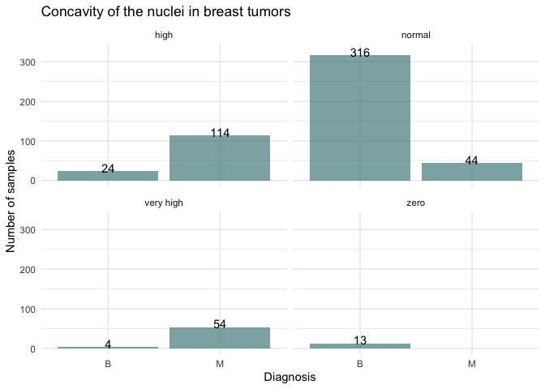
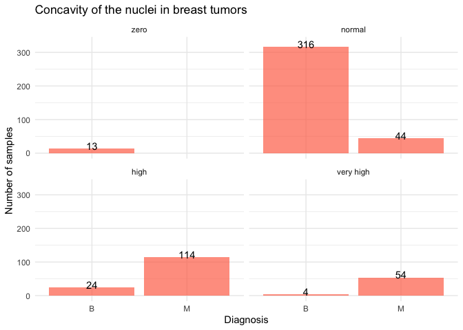
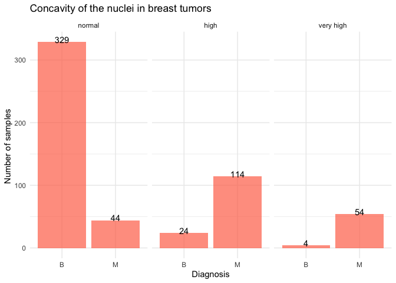
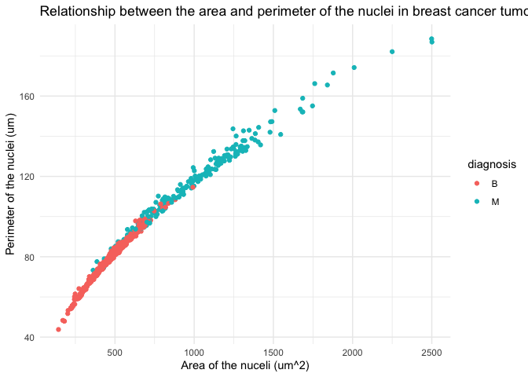

Milestone-3-Luque.Rmd
================
Ana Luque
October 28, 2021

Loading the packages:

``` r
#install packages with: install.packages("package") if not installed already
library(datateachr) #contains the cancer_sample data set I am working with.
library(tidyverse) #packages that allows to analyze data(tibble).
```

    ## ── Attaching packages ─────────────────────────────────────── tidyverse 1.3.1 ──

    ## ✓ ggplot2 3.3.5     ✓ purrr   0.3.4
    ## ✓ tibble  3.1.5     ✓ dplyr   1.0.7
    ## ✓ tidyr   1.1.4     ✓ stringr 1.4.0
    ## ✓ readr   2.0.2     ✓ forcats 0.5.1

    ## ── Conflicts ────────────────────────────────────────── tidyverse_conflicts() ──
    ## x dplyr::filter() masks stats::filter()
    ## x dplyr::lag()    masks stats::lag()

``` r
library(forcats) #package that helps analyzing factors.
library(broom) #provides the information of a model in a tibble.
library(here) #to create CSV files from tibbles
```

    ## here() starts at /Users/anacl/Documents/1_UBC/STAT545/Collaborative/Luque_Ana_Mini-Data-Analysis

# Introduction to the file

During Milestone 3, I will be working with the data set:
**Cancer_samples**. This tibble was obtained from the UCI Machine
Learning Repository and it contains information about the cell nuclei in
the biopsy of a breast cancer mass obtained with fine needle aspirate
(FNA) and analyzed through machine learning using digitized imaging. For
more information about the data set the README file on the Github
repository can be consulted.

On Milestone 2 four research questions were analyzed to determine if it
is possible to use Machine learning to process biopsy from cancer
patience and diagnose if the tumor is malign or benign. This could
significantly decrease the processing time it takes for the pathology
department to process samples. In cancer patients, time is quite
valuable, the sooner the treatment is started, the better the
probabilities of surviving. In this file I will be sharpening the
results by manipulating special data types (factors), fitting a model
and using it to make predictions.

**Research questions**

*1. Could it be possible to diagnose the tumor of a patient just by
looking at the concavity of the nuclei?*

*2. Is there a relationship between the area of the nuclei and the
perimeter in malign tumors?*

# Task 1: Special Data Types

For the first task I will be focusing in the next research question:

*1. Could it be possible to diagnose the tumor of a patient just by
looking at the concavity of the nuclei?*

## Reordering factors

Benign and malign tumors have different properties, the first ones tend
to still have some of the native markers of the cells. On the other
hand, malign tumors tend to have aberrant behavior and shape. The most
common way to diagnose a patient is analyzing a biopsy obtained from the
tumor, usually this is done by a pathologist. As mentioned before,
benign tumors tend to have properties similar to healthy cells, this
means that the shape of their nuclei is not as deformed as the ones of
malign cells.

The concavity of the nuclei refers to the severity of concave portions
of the contour. The higher the concavity the less likely that cells look
spherical. Healthy cells have spherical or oblong nucleus without severe
concave portions, having a concavity of zero. Aberrant cells have huge
concave portions having a concavity closer to one.

Based on the analysis done in Milestone 2, four categories were created.
The first category is zero, which only contains the samples that have no
concavity portions, therefore there is no severity in those portions,
having a spherical shape. Normal corresponds to nuclei whose concavity
value is less than 0.1, which is closer to the shape of healthy cells.
If the concavity is between 0.1 and 0.25, is labeled as high, since
those values indicate that there is a clear problem with the cell.
Higher than 0.25 were classified as very high, those cells have an
aberrant nucleus and definitely are undergoing a tumorous process.

Since R orders the categories alphabetically (Graph T1.4) there is a
need to *reorder the factors shown in the original plot*, since it does
not make sense having first the category high, then low, very low and
finally zero. The categories will be re-order so that in the plot they
appear from the lowest concavity to the highest, in numerical ascending
order (Graph T1.6). The ordering was done to help visualizing the
differences of the three categories and if more or just malign tumors
appeared in the high and very high category.

A factor is a categorical value that stores both string and integer data
values as levels, concavity will become a factor after dividing into
categories. Levels refers to the four categories created inside the
concavity factor

``` r
# A tibble was created including just the variables of interest for this research question, diagnosis and concavity, dropping irrelevant columns using the select function.
#The concavity variable(column header) was renamed so it will be easier to call them in a function using the rename function.
#It was arranged in ascending order according to the concavity using the arrange function.
T1.1 <- cancer_sample %>%
  rename(c("concavity_value"="concavity_mean"))%>%
  select(diagnosis, concavity_value) %>%
  arrange(concavity_value)

#A first approach to see if there is a difference between the two diagnosis groups is seeing at the summarized mean. 
#Group_by is used to create a grouped tibble so that the rest of the functions are perform in every group, in this case in both benign and malign tumors, and the results are shown separately.
#Summarise allows you to create new columns of summarized variables, giving one row per group. It can be used to calculate summary statistics
T1.2 <- T1.1 %>%
  group_by(diagnosis)%>%
  summarise(Mean_concavity = mean(concavity_value)) %>%
  mutate(across(where(is.numeric), ~ round(., 3)))
T1.2
```

    ## # A tibble: 2 × 2
    ##   diagnosis Mean_concavity
    ##   <chr>              <dbl>
    ## 1 B                  0.046
    ## 2 M                  0.161

``` r
#A tibble was created with just the variables of interest, diagnosis and concavity using the function select.
#The numerical variable of concavity were divided into zero, low, high, and very high categories using the mutate function to create a new column from an existing one.
#Case_when was used to categorize the values into 3 different categories, the true value is stated for the values that didn't meet the categories established before.
T1.3<- T1.1 %>%
     mutate(concavity = case_when (concavity_value ==0 ~  "zero", 
                                   concavity_value <0.1 ~  "normal", 
                                   concavity_value <0.2 ~  "high", 
                                   TRUE ~ "very high"))
T1.3
```

    ## # A tibble: 569 × 3
    ##    diagnosis concavity_value concavity
    ##    <chr>               <dbl> <chr>    
    ##  1 B                       0 zero     
    ##  2 B                       0 zero     
    ##  3 B                       0 zero     
    ##  4 B                       0 zero     
    ##  5 B                       0 zero     
    ##  6 B                       0 zero     
    ##  7 B                       0 zero     
    ##  8 B                       0 zero     
    ##  9 B                       0 zero     
    ## 10 B                       0 zero     
    ## # … with 559 more rows

``` r
# A bar graph was created using the ggplot2 package to visualize the number of samples in every category, the function ..count.. is used instead of the y axis to the bar graph, being able to show the number of samples instead of the frequencies.  
# Using geom_text the exact number of every category will appear in a label at the top of the bar graph. 
T1.4 <- ggplot(T1.3, aes(diagnosis, ..count..)) +
   geom_bar(fill= "darkslategray4", alpha = 0.7, position = "dodge") +
   facet_wrap(~ concavity) +
   geom_text(aes(label = ..count..), stat = "count", vjust = 0.1)
print(T1.4)
```

<!-- -->

``` r
#The factors will be re order so they not appear alphabetically but in ascending concavity order
#Fct_inorder from the forcats package reorder factor levels by the order in which they first appear in the tibble (concavity ascending order)
#The same plot is created, now using the modified data set with the levels re-ordered
T1.5 <- T1.3 %>%
mutate(concavity= fct_inorder(concavity)) %>%
ggplot(aes(diagnosis, ..count..)) +
   geom_bar(fill= "coral 1", alpha = 0.7, position = "dodge") +
   facet_wrap(~ concavity) +
   geom_text(aes(label = ..count..), stat = "count", vjust = 0.1)
print(T1.5)
```

<!-- -->

*Analysis*

By analyzing just the grouped means it is obvious that there is a clear
difference between the two groups, being the average concavity of malign
tumors around 350 times bigger than the benign samples.The T1.5 graph is
ordered by ascending concavity, in that way it is easier to detect that
the only samples that do not have concavity portions are benign tumors
and that most of their samples are in the normal category. Nevertheless,
there is presence of benign samples in both high and very high
categories making it impossible to diagnose a tumor just by it’s
concavity.

## Grouping some factor levels

The category “Zero” contains just the 2.3% of the samples it doesn’t
represents a huge portion of the population. Moreover, it is probable
that those samples were actually healthy cells and none from the tumor,
because in some cases is hard to separate the two populations.
Furthermore, even healthy cells sometimes have a level of concavity
portions, for that reason zero could be grouped with the category of
normal. Having less categories the plot presented is easier to read.

``` r
T1.6 <- T1.3 %>%
#fct_collpase is a function in the forcats package used to group some factor levels together you need to specify the factor, the new level and the levels you are going to collapse 
mutate(concavity = fct_collapse(concavity, normal =c("zero","normal"))) %>%
mutate(concavity= fct_inorder(concavity))
print(T1.6)
```

    ## # A tibble: 569 × 3
    ##    diagnosis concavity_value concavity
    ##    <chr>               <dbl> <fct>    
    ##  1 B                       0 normal   
    ##  2 B                       0 normal   
    ##  3 B                       0 normal   
    ##  4 B                       0 normal   
    ##  5 B                       0 normal   
    ##  6 B                       0 normal   
    ##  7 B                       0 normal   
    ##  8 B                       0 normal   
    ##  9 B                       0 normal   
    ## 10 B                       0 normal   
    ## # … with 559 more rows

``` r
#A graph similar to the one in T1.5 was created using T1.6(the ordered and collapsed data set) to show that there are now 3 categories instead of 4.
T1.7 <- T1.6 %>%
ggplot(aes(diagnosis, ..count..)) +
   geom_bar(fill= "coral 1", alpha = 0.7, position = "dodge") +
   facet_wrap(~ concavity) +
   geom_text(aes(label = ..count..), stat = "count", vjust = 0.1)
print(T1.7)
```

<!-- -->

*Analysis*

Grouping the zero and normal category makes sense because zero belongs
to the normal category as well as cells with a low concavity (less than
0.1). In this new plot the 3 categories are organized in a horizontal
way making it easier to see that there are more samples in the normal
category and that malign tumors have a bigger representation in the
categories high and very high. Meaning that malign tumors tend to have
more aberrant nuclei shape with more severe concavity portions.

# Task 2: Modelling

For the second task I will be focusing in the next research question and
variable:

**Research question:** *2. Is there a relationship between the area of
the nuclei and the perimeter in malign tumors?*

**Variable** Perimeter of the nuclei (area_mean)

Using this research question it would be possible to create a model that
accurately creates predictions based on two variables.First of all a
scatter plot was created to see the relationship between area and
perimeter of the nuclei in the two diagnosis groups, to see if it makes
sense using different models for benign and malign tumors. Both
perimeter and area should be related by a linear model, since there is a
mathematical relationship between them, however the nuclei don’t have a
perfect round shape. Since the data was obtained by computational
analysis maybe the model won’t be perfect and I think is worth exploring
it, to see if the measurements are reliable. Finally these two variables
are the ones whose mean values grouped by diagnosis are more different
between them. So analyzing them could give us a good approach to
determine the diagnose of a biopsy.

A function will be used to obtain the summary of the model with useful
values like R^2 to validate that the model fits the data. Later on it
would be use to do predictions in the same data obtaining fit values and
its errors. Finally the model for malign tumors will be used in the data
of benign tumors to see if it is a good a approximation or how much it
deviates from the original data.

``` r
#A scatter plot was created (using ggplot2 package geom_pint function) to visualize the relationship between perimeter and area of the nuclei of both diagnosed groups
## The aesthetic specification can be in the ggplot function or in the geom layers, when used in the geom layers is to specify that the functions is related to variables in the data set.
T2.0<- cancer_sample %>%
  ggplot(aes(area_mean, perimeter_mean)) + 
  geom_point(aes(colour=diagnosis))
T2.0
```

<!-- -->

``` r
#First a tibble was created from the cancer_samples data set with the variables of interest, dropping irrelevant columns.
#The variables of interest were renamed so it will be easier to call them in a function.
#It was arranged in ascending order according to the area.
#It was filtered just the samples diagnosed as malign, since those are the samples I will be focusing on.
T2.1<- cancer_sample %>%
  rename(c("area"="area_mean", "perimeter"="perimeter_mean")) %>%
  select(diagnosis, area, perimeter) %>%
  arrange(area)%>%
  filter(diagnosis == "M")
T2.1
```

    ## # A tibble: 212 × 3
    ##    diagnosis  area perimeter
    ##    <chr>     <dbl>     <dbl>
    ##  1 M          362.      73.3
    ##  2 M          371.      71.9
    ##  3 M          386.      77.6
    ##  4 M          431.      75  
    ##  5 M          432       79.0
    ##  6 M          441.      77.9
    ##  7 M          476.      84.0
    ##  8 M          477.      82.6
    ##  9 M          477.      81.2
    ## 10 M          499       82.7
    ## # … with 202 more rows

``` r
#To create a model they type of model need to be specified using the arguments of the y variable, x variable and the data set where the variables are located
#lm is used to fit linear models.
# The model was stored in the variable T2.2
  T2.2 <- lm(perimeter ~ area, T2.1)
print(T2.2)
```

    ## 
    ## Call:
    ## lm(formula = perimeter ~ area, data = T2.1)
    ## 
    ## Coefficients:
    ## (Intercept)         area  
    ##    57.99464      0.05864

``` r
#For better visualization of the model glance (from the broom package) function was used to validate the model.
#Glance returns a tibble that contains the summary of typically goodness of fit measures, p-values for hypothesis tests on residuals etc..
T2.3 <-glance(T2.2)
T2.3
```

    ## # A tibble: 1 × 12
    ##   r.squared adj.r.squared sigma statistic   p.value    df logLik   AIC   BIC
    ##       <dbl>         <dbl> <dbl>     <dbl>     <dbl> <dbl>  <dbl> <dbl> <dbl>
    ## 1     0.975         0.974  3.49     8061. 1.73e-169     1  -565. 1136. 1146.
    ## # … with 3 more variables: deviance <dbl>, df.residual <int>, nobs <int>

``` r
#Since the r.squared and the p.value shows promising results predictions can be made using the model 
# Augmente function froom the broom package adds predictions of the dependent variable using the model, residuals, and cluster assignments to the original data that was modeled (malign samples)
T2.3 <-augment(T2.2)
T2.3
```

    ## # A tibble: 212 × 8
    ##    perimeter  area .fitted .resid   .hat .sigma .cooksd .std.resid
    ##        <dbl> <dbl>   <dbl>  <dbl>  <dbl>  <dbl>   <dbl>      <dbl>
    ##  1      73.3  362.    79.2  -5.90 0.0180   3.47 0.0267      -1.71 
    ##  2      71.9  371.    79.8  -7.86 0.0176   3.46 0.0463      -2.27 
    ##  3      77.6  386.    80.6  -3.06 0.0170   3.49 0.00674     -0.883
    ##  4      75    431.    83.3  -8.27 0.0152   3.45 0.0440      -2.39 
    ##  5      79.0  432     83.3  -4.34 0.0152   3.49 0.0121      -1.25 
    ##  6      77.9  441.    83.8  -5.90 0.0148   3.47 0.0218      -1.70 
    ##  7      84.0  476.    85.9  -1.93 0.0136   3.50 0.00213     -0.557
    ##  8      82.6  477.    86.0  -3.40 0.0135   3.49 0.00659     -0.981
    ##  9      81.2  477.    86.0  -4.84 0.0135   3.48 0.0133      -1.40 
    ## 10      82.7  499     87.3  -4.57 0.0128   3.48 0.0112      -1.32 
    ## # … with 202 more rows

``` r
#In order to teste the model using the area of the benign samples as the independent variable a new tibble need to be created
#I filter the samples that contains B as the diagnosis
#The tibble need to have the same column names of he dependent (perimeter) and independent (area) variables 
#The model can only be used in tibbles that have the same size as the original tibble, for that reason just the first 212 rows were selected
B1<- cancer_sample %>%
  rename(c("area"="area_mean", "perimeter"="perimeter_mean")) %>%
  select(diagnosis, area, perimeter) %>%
  arrange(area)%>%
  filter(diagnosis == "B")%>%
  slice(1:212)


#Predictions of the perimeter usgin the area of the nucli of bening tumors.
#Besides specifiying the model the new data set (B1 from the are will be ontain) needs to be specified.
T2.3 <-augment(T2.2, B1)
T2.3
```

    ## # A tibble: 212 × 9
    ##    diagnosis  area perimeter .fitted .resid   .hat .sigma .cooksd .std.resid
    ##    <chr>     <dbl>     <dbl>   <dbl>  <dbl>  <dbl>  <dbl>   <dbl>      <dbl>
    ##  1 B          144.      43.8    79.2  -35.4 0.0180   3.47 0.0267      -1.71 
    ##  2 B          170.      48.3    79.8  -31.4 0.0176   3.46 0.0463      -2.27 
    ##  3 B          179.      48.0    80.6  -32.7 0.0170   3.49 0.00674     -0.883
    ##  4 B          181       47.9    83.3  -35.4 0.0152   3.45 0.0440      -2.39 
    ##  5 B          202.      51.7    83.3  -31.6 0.0152   3.49 0.0121      -1.25 
    ##  6 B          204.      53.3    83.8  -30.6 0.0148   3.47 0.0218      -1.70 
    ##  7 B          221.      54.1    85.9  -31.8 0.0136   3.50 0.00213     -0.557
    ##  8 B          221.      54.5    86.0  -31.4 0.0135   3.49 0.00659     -0.981
    ##  9 B          222.      54.7    86.0  -31.3 0.0135   3.48 0.0133      -1.40 
    ## 10 B          224.      54.3    87.3  -32.9 0.0128   3.48 0.0112      -1.32 
    ## # … with 202 more rows

*Analysis*

Viewing the scatter plot from T2.0 it can be seen that there is a linear
relation ship between the area and the perimeter of the nuclei in both
benign and malign tumors, therefore the linear model function can be
used. Nevertheless the groups (marked with different colors) have
different slopes, so it would not be appropriate to use the same model
for both groups. To use a model juts for malign tumors a new tibble
needs to be created and is the one in T2.1. The model just show the
coefficients and intercepts (the equation), but with that information
you cannot know if it is a good fit.

The glance function shows values that are useful to validate the model.
The r^2 is value used to see how good the model fits the data, it
indicates the percentage of the variance in the dependent variable that
the independent variables explain collectively. The closer the r^2 is to
1 the better the fit. Having a value of 0.97 represents that the data
have a linear relationship and that it can be explained by the model.

Moreover, the p-value tests the null hypothesis that there is no linear
relationship between the two variables. A low p-value like the one
obtained by my model indicates that you can reject the null hypothesis
demonstrating that thee is a *significant linear relationship between
the two values*.

Haven proven that the model has a good fit it can be used to make
predictions. In T2.3 it is shown that the fitted perimeter appears next
to the original data, it also can be seen the difference between the two
values. The predicted values are quite similar (±5) in most of the
samples Finally, the model was used to predict the perimeter based on
the are of the nuclei of benign samples. As stated before the behavior
of these diagnosis group is different, yielding predicted values with
higher difference from the original values.

# Task 3: Reading and writing data

## 3.1

A CSV will be created from a table done in Milestone 2, Task 1.2,
Research question 1.

``` r
#Group_by is used to create a grouped tibble so that the rest of the functions are perform in every group, in this case in both benign and malign tumors, and the results are shown separately.
#Arrange order the rows of a data frame in ascending order.
#Summarise allows you to create new columns of summarized variables, giving one row per group. It can be used to calculate summary statistics
#n() functions will count the number of rows in a group and will give the amount of benign and malign samples
#Mutate is used to create new variables using the existing variables, in this case is used in all numeric values to round up to one decimal
T3.1 <- cancer_sample %>%
  group_by(diagnosis) %>%
  arrange(area_mean)  %>%
  summarise(Mean_area = mean(area_mean),
            SD_area = sd(area_mean),
            Min_area = min(area_mean),
            Median_area = median(area_mean),
            Max_area = max(area_mean), n=n()) %>%
  mutate(across(where(is.numeric), ~ round(., 1)))
T3.1
```

    ## # A tibble: 2 × 7
    ##   diagnosis Mean_area SD_area Min_area Median_area Max_area     n
    ##   <chr>         <dbl>   <dbl>    <dbl>       <dbl>    <dbl> <dbl>
    ## 1 B              463.    134.     144.        458.     992.   357
    ## 2 M              978.    368.     362.        932     2501    212

``` r
#Write_csv is a function used to convert the tibble (write) into a comma-separated value (csv) file 
#The name of the folder where it will be located and the name of the new file is specified in quotations 
#Here function from the Here package allow you to locate where the RMD file is located
#The quotations are used to specify the name of the folder where the file will be saved
write_csv(T3.1, here("Output", "Area_tumors_exported_file.csv"))
dir(here::here("Output")) #To know the location of the file
```

    ## [1] "Area_tumors_exported_file.csv"

## 3.2

The linear model showing the relationship between the area and the
perimeter of the nuclei of malign tumors will be saved to an R binary
file (an RDS). The the model can be loaded again into a new variable

``` r
#SaveRDS need the name of the model, the location where it will be saved and the name of the new file
saveRDS(T2.2, here("Output", "model.rds"))
dir(here::here("Output"))
```

    ## [1] "Area_tumors_exported_file.csv" "model.rds"

``` r
#The model will be loaded and save into a new variable called T3.2
#ReadRDS needs the location and name of the file 
T3.2 <- readRDS(here("output", "model.rds"))
T3.2
```

    ## 
    ## Call:
    ## lm(formula = perimeter ~ area, data = T2.1)
    ## 
    ## Coefficients:
    ## (Intercept)         area  
    ##    57.99464      0.05864
